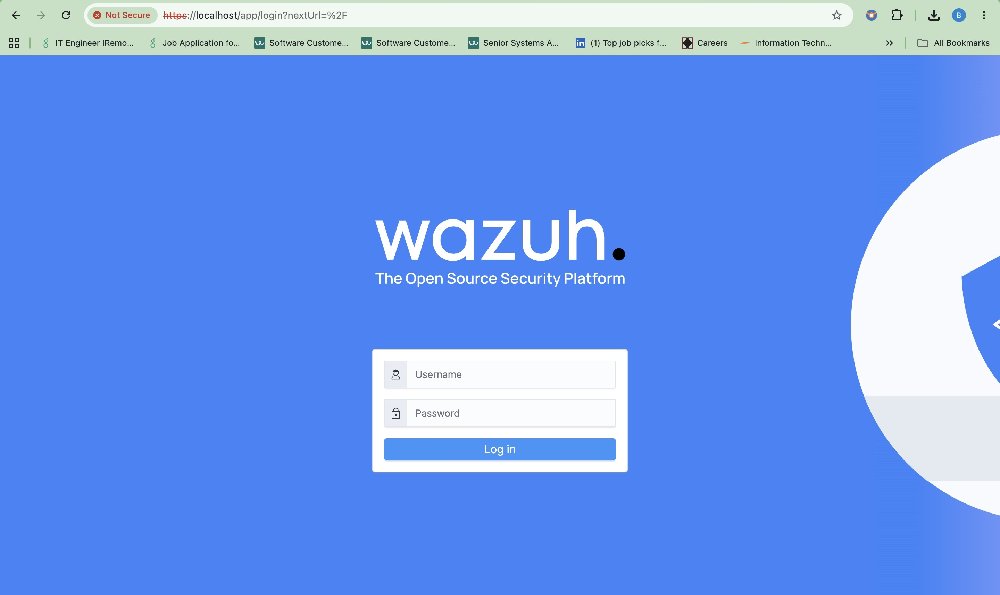
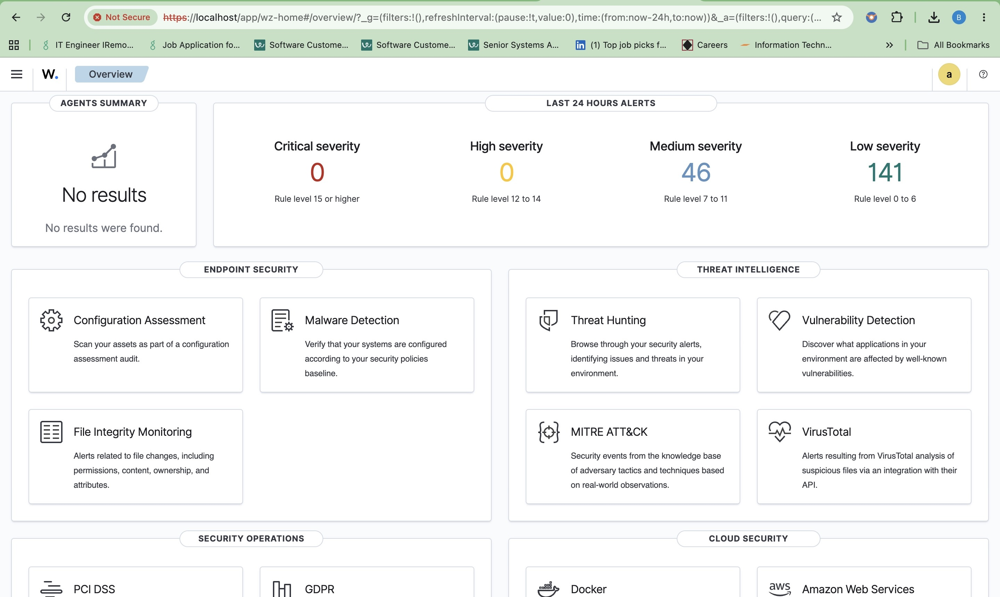
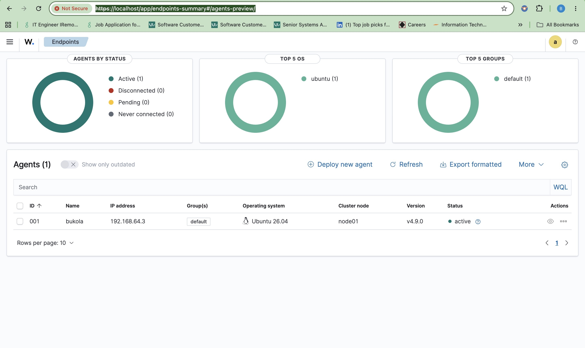
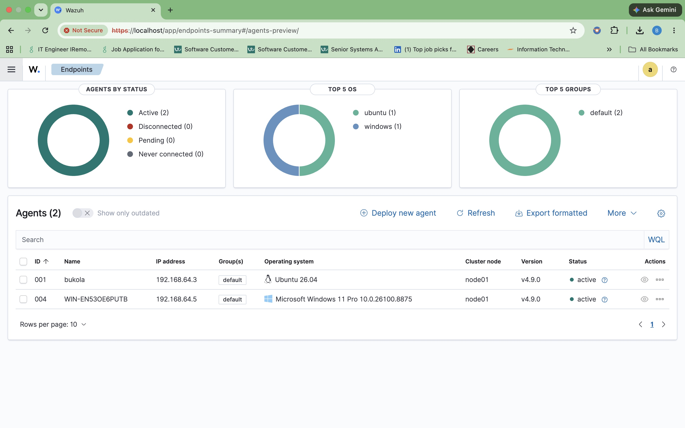
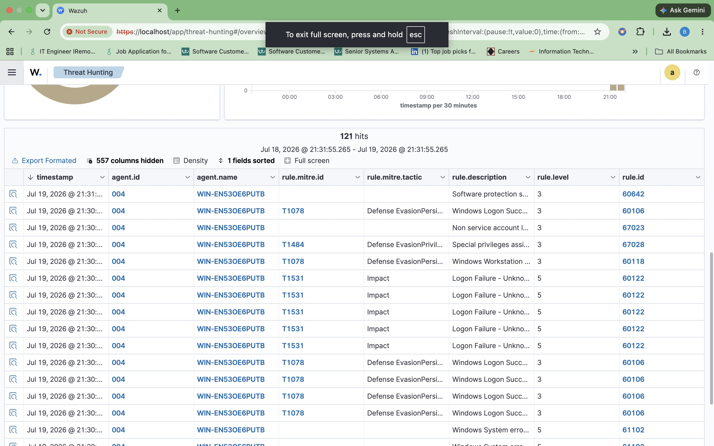
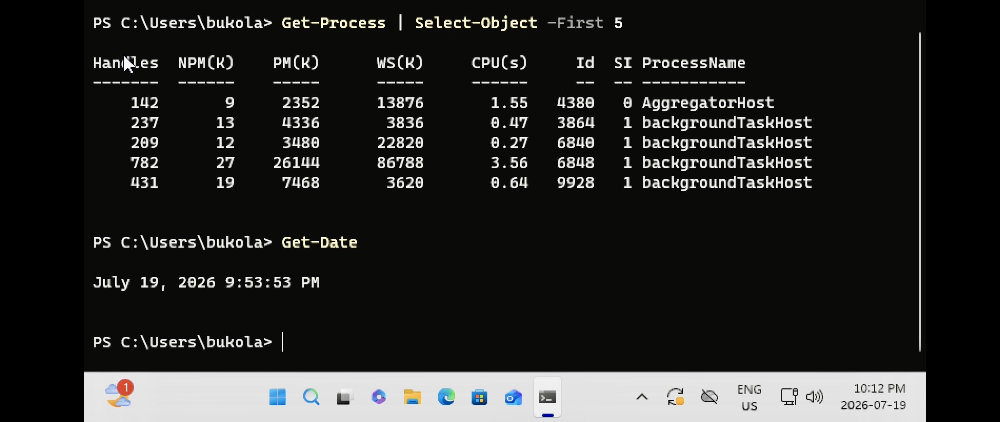
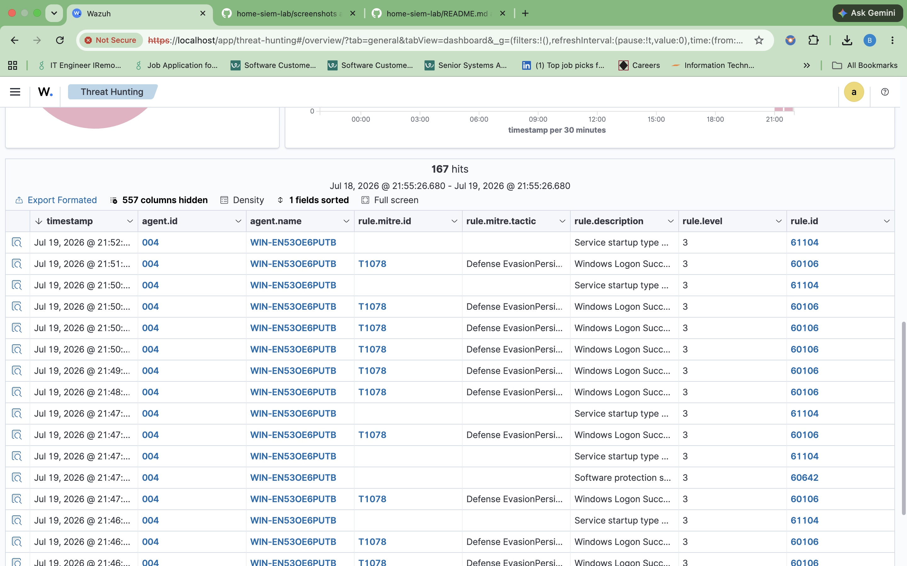
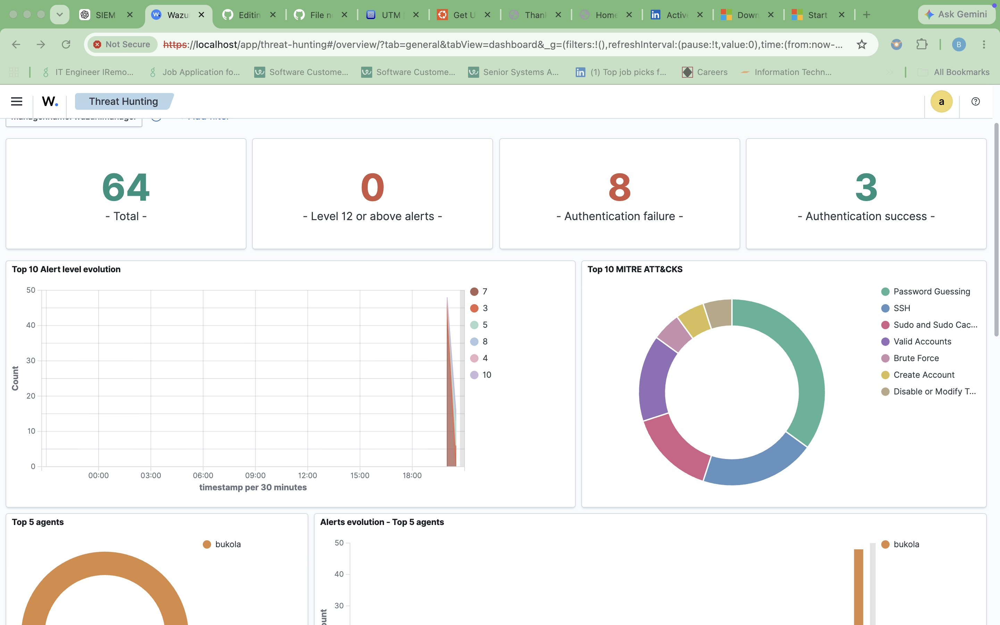
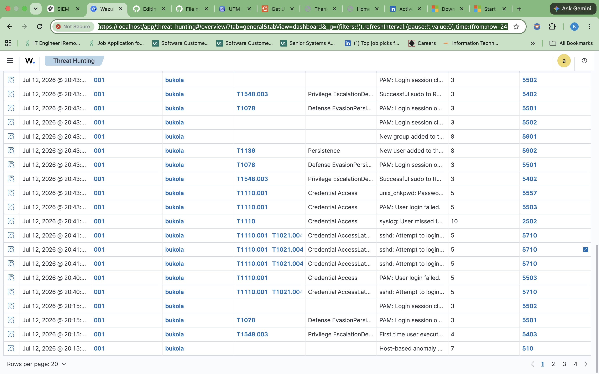

Home SIEM Lab: Threat Detection & Log Analysis

A self-hosted Security Information and Event Management (SIEM) lab built to practice log collection, threat detection, alert tuning, and incident visualization — using free, open-source tools on a MacBook. Includes two live endpoints: an Ubuntu Server and a Windows 11 (ARM64) machine, both actively reporting to a single Wazuh manager.
Overview

This project simulates a small enterprise security monitoring environment. It covers the full detection lifecycle: from raw log collection on endpoints, to correlation and alerting in a SIEM, to dashboards summarizing detected activity.

Goal: Understand how a SOC analyst uses a SIEM to detect and investigate suspicious behavior — brute-force login attempts, unauthorized account creation, and suspicious command execution.

```
┌─────────────────┐        ┌─────────────────┐
│  Ubuntu VM       │        │  Windows VM      │
│  (Wazuh Agent)   │        │  (Wazuh Agent)   │
└────────┬─────────┘        └────────┬─────────┘
         │        Encrypted log forwarding      │
         └───────────────┬───────────────────────┘
                          ▼
              ┌───────────────────────┐
              │   Wazuh Manager        │
              │   (Docker, on MacBook) │
              │   - Log ingestion      │
              │   - Rule correlation   │
              │   - Alerting engine    │
              └───────────┬────────────┘
                          ▼
              ┌───────────────────────┐
              │   Wazuh Dashboard      │
              │   (Kibana-based UI)    │
              └───────────────────────┘
```

Tools used:


Wazuh Manager + Dashboard (Docker on macOS)
UTM / VirtualBox for endpoint VMs
Ubuntu Server (Linux endpoint)
Windows 10/11 (Windows endpoint)


Setup Steps

1. Deploy the SIEM


Installed Docker Desktop on macOS.
Deployed Wazuh single-node stack via wazuh-docker repo.
Accessed dashboard at https://localhost:443.


2. Collect and Centralize Logs


Provisioned Ubuntu and Windows VMs via UTM.
Installed Wazuh agents on each, registered to the manager.
Verified agent connectivity status = Active.


3. Generate and Ingest Security Events

Simulated activity to produce log data:


Repeated failed SSH login attempts (brute-force simulation)
Local user account creation (useradd / Windows local user)
Suspicious command execution (reverse shell listener, unauthorized download)


4. Analyze Logs and Configure Alerts


Reviewed raw events under Threat Hunting.
Wrote a custom correlation rule in local_rules.xml to flag 5+ failed logins within 60 seconds.
Tuned rule severity levels to reduce false positives.


Example custom rule:

xml<rule id="100010" level="10">
  <if_matched_sid>5716</if_matched_sid>
  <same_source_ip />
  <description>Multiple failed SSH logins from same source - possible brute force</description>
  <mitre>
    <id>T1110</id>
  </mitre>
</rule>

5. Visualize and Report Findings


Built a dashboard tracking failed login trends, alert severity distribution, and top targeted accounts.
Captured screenshots of triggered alerts and dashboard views (see /screenshots).


Findings & Detections

| Simulated Activity | Detected? | Rule Triggered | Severity |
|---|---|---|---|
| SSH brute force | ✅ | Custom rule 100010 | High |
| New local account | ✅ | Wazuh default rule (T1136) | Medium |
| Reverse shell attempt | ✅ | Wazuh default rule | High |
| Sudo privilege escalation | ✅ | Wazuh default rule (T1548.003) | Medium |


Screenshots

### Wazuh Login


### Dashboard Overview


### Agent 1 Status (Ubuntu)


## Ubuntu Endpoint Integration

An Ubuntu 26.04 virtual machine was deployed and connected to the Wazuh SIEM manager running in Docker to provide Linux endpoint monitoring and security event collection.

### Configuration

- Endpoint: Ubuntu 26.04
- Virtualization: UTM
- Host platform: Apple Silicon Mac
- Wazuh agent version: 4.9.0
- Manager address: 192.x.x.x
- Agent communication: TCP 1514
- Agent enrollment: TCP 1515
- Status: Active

The Wazuh agent was installed on the Ubuntu endpoint, registered with the Wazuh manager, and configured to automatically start as a system service. The endpoint successfully communicates with the manager and sends security events, system inventory, and log data for centralized monitoring.


### Agent 2 Status (Windows)


## Windows 11 Endpoint Integration

A Windows 11 Pro ARM64 virtual machine was deployed in UTM on an Apple Silicon Mac and connected to the Wazuh SIEM manager running in Docker.

### Configuration

- Endpoint: Windows 11 Pro
- Virtualization: UTM
- Host platform: Apple Silicon Mac
- Wazuh agent version: 4.9.0
- Manager address: 192.x.x.x
- Agent communication: TCP 1514
- Agent enrollment: TCP 1515
- Status: Active

The endpoint was successfully enrolled using `agent-auth.exe`, and the Wazuh service was started on the Windows system.

## Detection Test 1 – Failed Windows Logon

### Objective

Validate that the Wazuh SIEM detects failed Windows logon attempts from a monitored endpoint.

### Procedure

1. Locked the Windows 11 virtual machine.
2. Entered an incorrect password five consecutive times.
3. Logged in successfully using the correct password.
4. Opened the Wazuh Threat Hunting dashboard.
5. Filtered events for the Windows endpoint.

### Results

Wazuh successfully detected the failed logon attempts and generated Windows Security alerts.

**Observed alerts**

- Logon Failure
- Windows Logon Success
- Special privileges assigned
- Non-service account logon

### Outcome

The test confirmed that the Windows endpoint is successfully forwarding Security Event Logs to Wazuh and that the default detection rules identify authentication failures.



## Detection Test 2 – PowerShell Activity

### Objective

Evaluate the default Windows logging configuration to determine whether PowerShell activity is detected and forwarded to the Wazuh SIEM.

### Procedure

1. Opened Windows PowerShell.
2. Executed the following commands:

```powershell
Get-Process | Select-Object -First 5
Get-Date
```
### PowerShell Commands Executed



### Threat Hunting Results


3. Allowed the Wazuh agent time to forward events.
4. Reviewed the **Threat Hunting** dashboard for PowerShell and process-related activity.

### Results

No dedicated PowerShell execution alerts or process creation events were generated after running the commands. The Threat Hunting dashboard continued to display standard Windows Security events, including:

- Windows Logon Success
- Service startup type changes
- Software protection service events

### Investigation Summary

The test demonstrated that the default Windows logging configuration provides limited visibility into PowerShell execution. While the Windows endpoint continued to successfully forward security events to the Wazuh Manager, no detailed telemetry was available for the executed PowerShell commands.

This behavior is expected on a default Windows installation and highlights the importance of enhanced telemetry solutions such as **Sysmon**, which provides detailed process creation, command-line logging, network connections, registry modifications, and other security-relevant events.

### Outcome

This test established a baseline for Windows event collection prior to installing Sysmon. A follow-up comparison will be performed after Sysmon is deployed to demonstrate the improvement in endpoint visibility and detection capabilities.


### Threat Hunting Overview


### Threat Hunting — Simulated Events



## Lessons Learned

- Initially wrote a custom correlation rule (100010) keyed to Wazuh's default rule 5716 
("authentication failed"), but testing with a nonexistent username triggered rule 5710 
("invalid user") instead — a different failure path than expected. Diagnosed the mismatch 
by inspecting the manager's rule definitions directly inside the Docker container, corrected 
the `if_matched_sid` reference, and confirmed the rule fired correctly on retest (11 hits, 
level 10, MITRE T1110).

- I also encountered a Wazuh agent/manager version mismatch (agent 4.14.6 vs manager 4.9.0) 
that silently rejected registration — resolved by pinning the agent install to the matching 
manager version.

Next Steps


Add Sysmon to Windows endpoint for deeper process-level visibility.
Integrate with a SOAR playbook for automated response.
Add MITRE ATT&CK mapping to all custom rules.


Disclaimer

This lab is for educational purposes only, built entirely in an isolated local environment. No production systems or real user data were involved.
